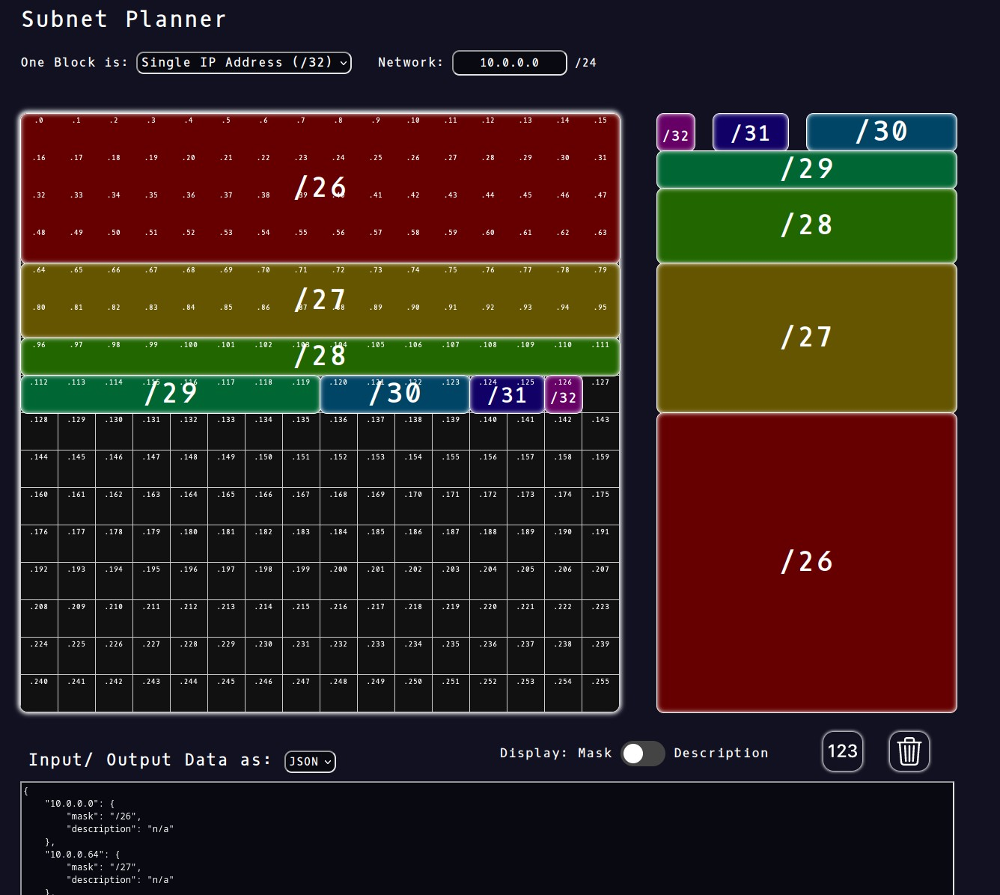

# Subnet Planner 🚀

The Subnet Planner is a web tool designed to make subnetting easier.
Each subnet is displayed as a square made up of blocks, representing its relative size.
On the canvas, a grid of blocks is presented, where you can choose whether each block is either a single address (`/32`) or a Class C subnet (`/24`).
When you add a subnet to the network, it is automatically added to the next fit, which, given the nature of subnets being always a power of 2 in size, is simple yet efficient.
The subnet configuration is automatically output to the text field at the bottom and can be saved to reconstruct the canvas later.

This is how it looks rn:



## How to run

The subnet planner doesn't require any installation, you just need to open `html/index.html` in your browser.
The file consists only of HTML, CSS and vanilla JavaScript.

## Data Input/ Output

Currently only data input and output in the `JSON` file format is supported.
The files generated and used for input of subnets have the following structure:

```json
{
    "10.67.0.0": {
        "mask": "/24",
        "description": "some description"
    }, ...
}
```

The network (first 2 or 3 octets, depending on block size) is not derived from the input data, but defined globally in the `Network` input field.

Future Versions will support input/ output of data in the form of:

1. `CSV` files (both with `,` and `;` (as in `SCSV`) as delimiter)
1. Simple list of subnets
1. `JSON` with different structures

## Features to be added in the future

- Move subnets with drag and drop
- More file formats, see above
- Additional tools for subnetting:
  - Subnet validator
  - Customizable table of subnet sizes
